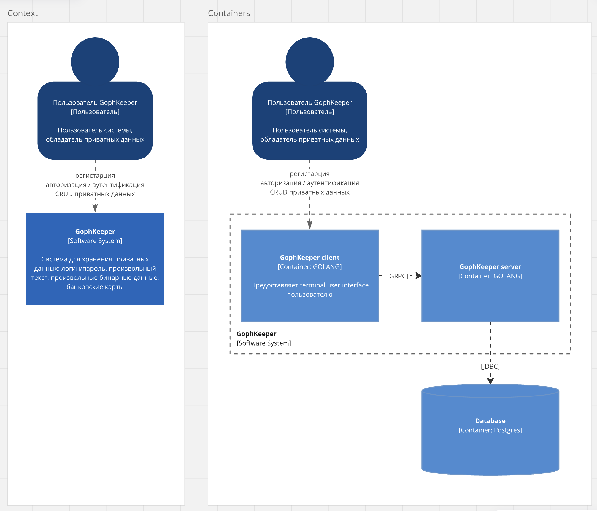
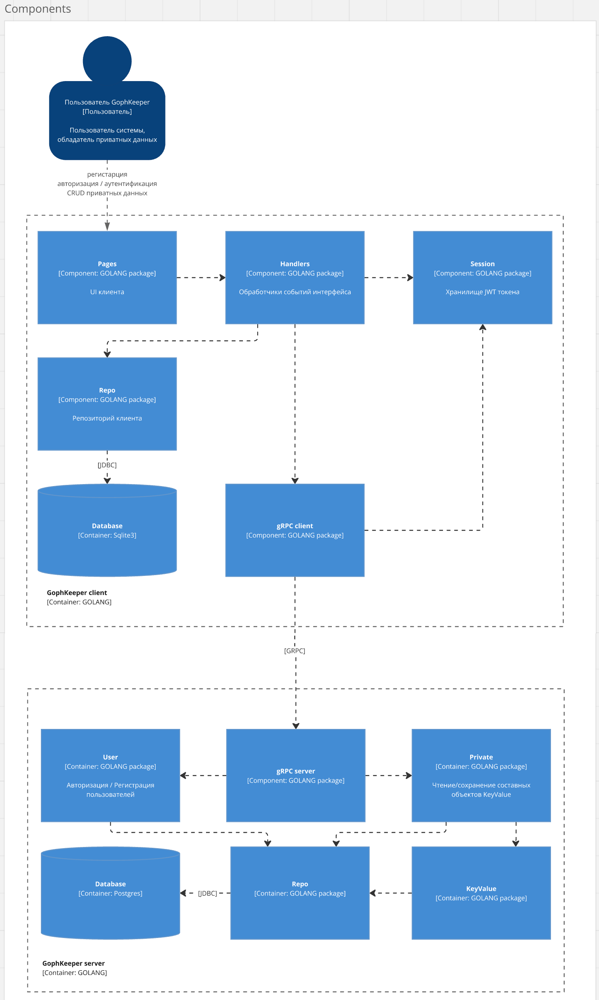

# Goph Password Keeper


## Архитектура проекта



## Структура проекта

    .
    ├── cmd                 
    │   ├── client           # Приложение клиента 
    │   └── server           # Приложение сервера
    ├── internal             # Внутренний код
    │   ├── client           
    │   │   ├── app         
    │   │   └── infra
    │   ├── common        
    │   │   └── dto          # Domain слой
    │   └── server           
    │       ├── app        
    │       ├── infra         
    │       └── test
    └── ...

## Запуск проекта

Создать в корне .env.client

```
DATABASE_FILE=
GRPC_ADDRESS=
```

Создать в корне .env.server

```
DATABASE_DSN=
GRPC_ADDRESS=
JWT_SECRET=
```

Подготовка окружения и запуск

```bash
make up
```
```bash
make protoc
```
